# Cloud Resume — Static Website on AWS (S3 + CloudFront + ACM)

This project implements a personal static website hosted on Amazon S3, served globally through CloudFront, and secured with a custom domain using ACM-issued SSL certificates.  
All deployment steps and evidence are included below.

---

## Project Structure

cloud-resume/
├── website/
│   ├── index.html
│   ├── styles.css
├── README.md
├── docs/
│   ├── setup.md
│   ├── DOCUMENTATION.md
│   └── images/

---

# 1. GitHub Setup & Local Project Creation

### GitHub repository created  
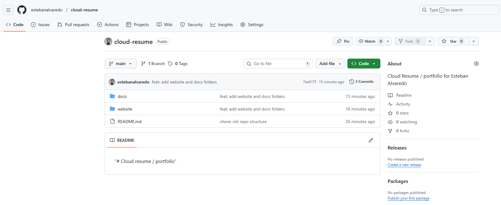

### Local HTML/CSS development  
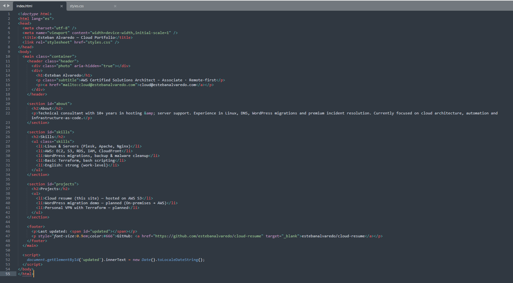

### Files uploaded to GitHub  
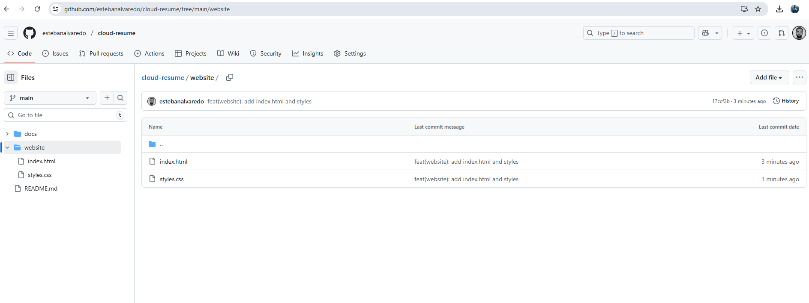

### Local preview before deployment  
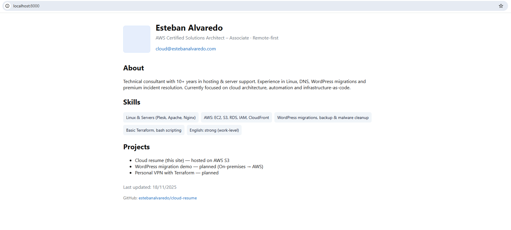

---

# 2. Deploying Website to S3

### S3 bucket created  
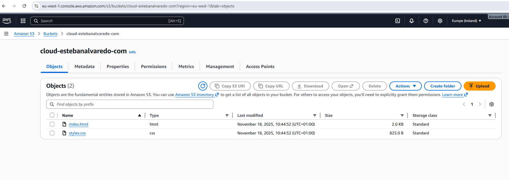

### Website uploaded to bucket  
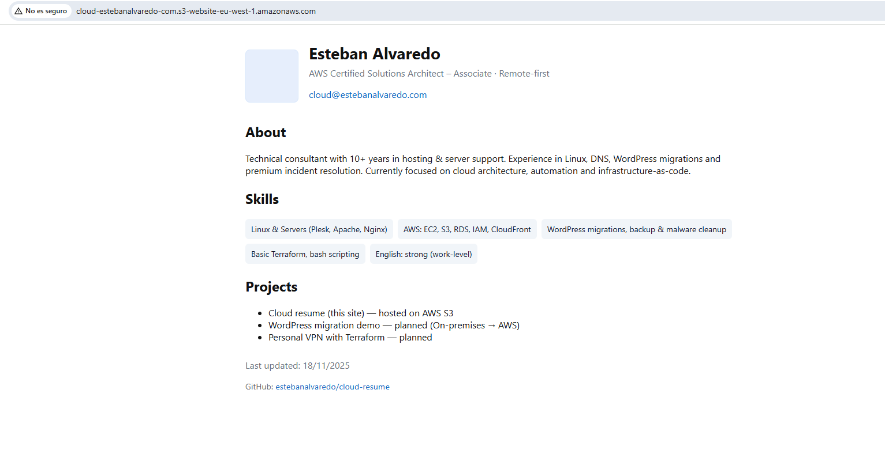

### Initial project setup documented  
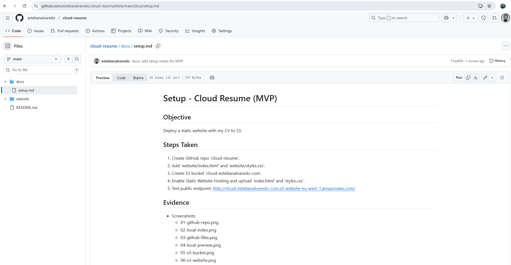

---

# 3. Improving HTML/CSS

### Adding <meta> tags  
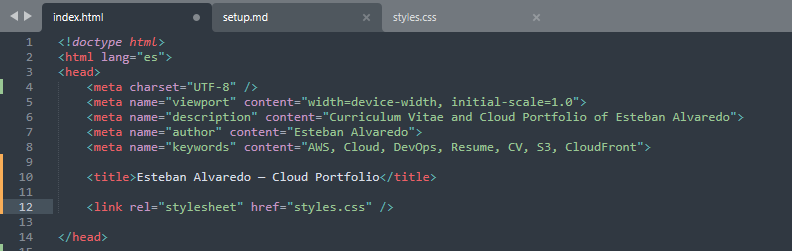

### Git commit & push  

### Updated version uploaded to S3  
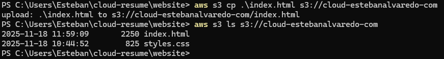

### Browser preview after update  
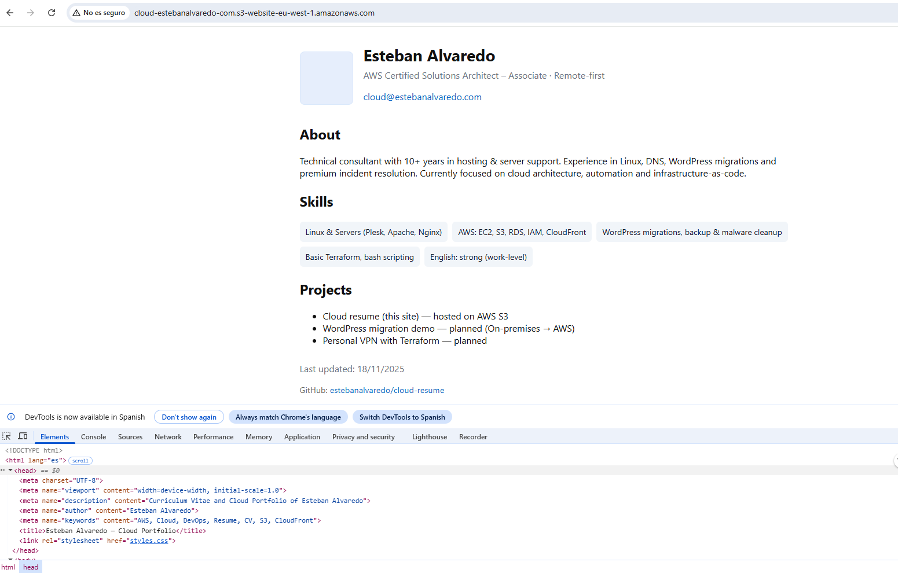

---

# 4. Website Redesign

### Section reorganized in docs  
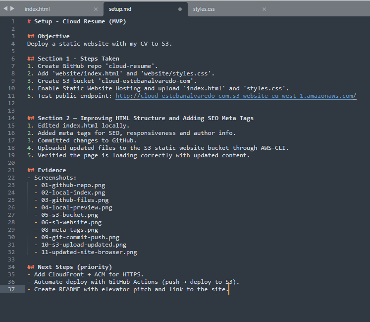

### Testing CSS changes locally  
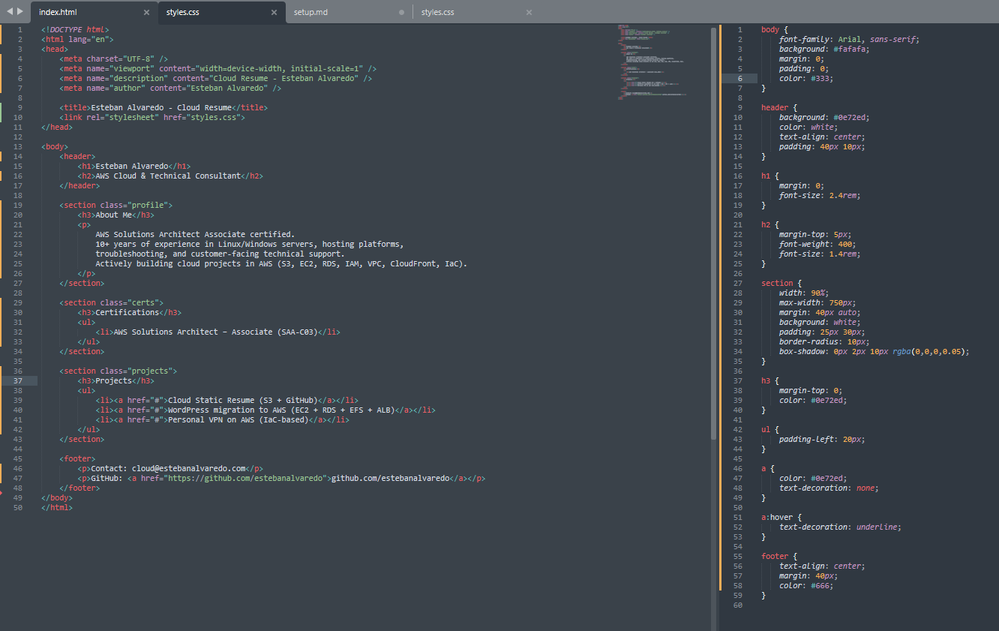

### Git commit for redesign  
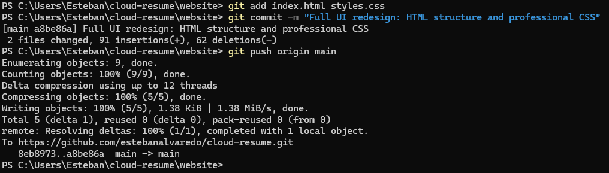

### Uploading redesign to S3  
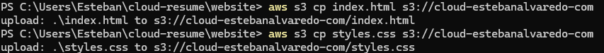

### New design displayed in browser  
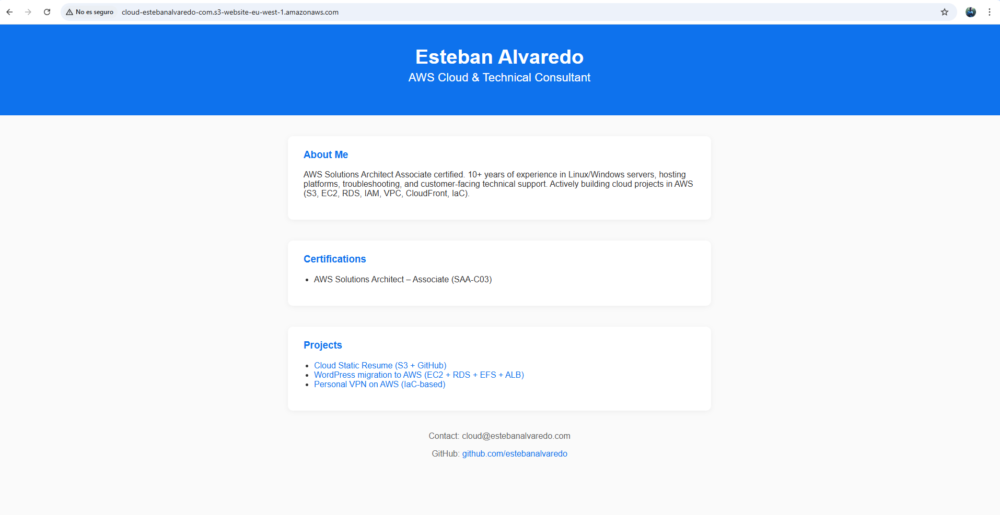

### Favicon added  
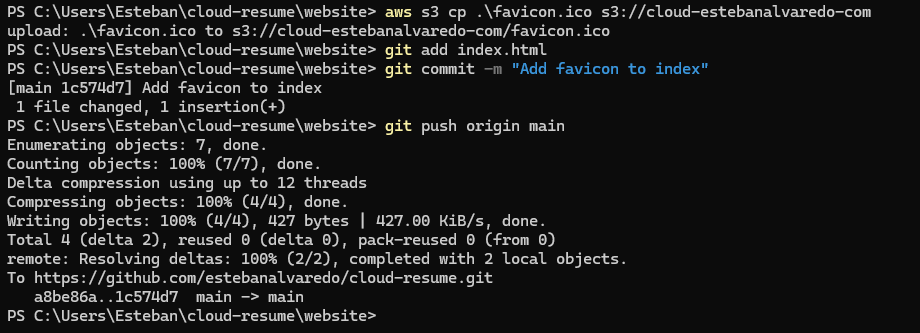

---

# 5. CloudFront + HTTPS (ACM)

### CloudFront distribution created  
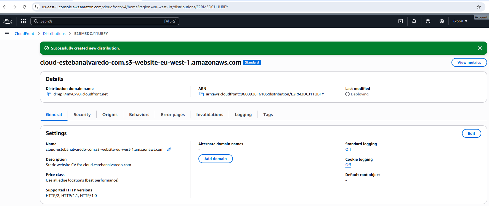

### ACM certificate requested  
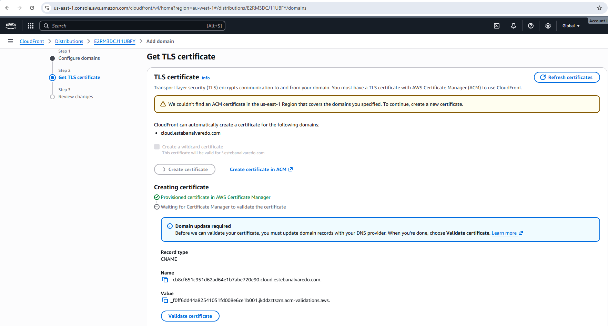

### ACM DNS validation record  
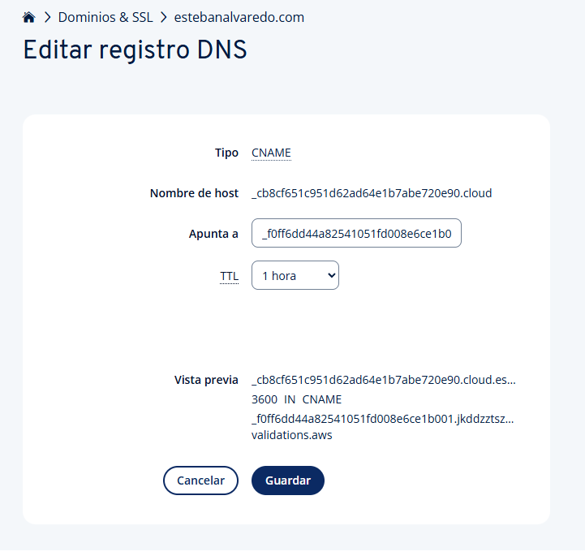

### ACM certificate issued  
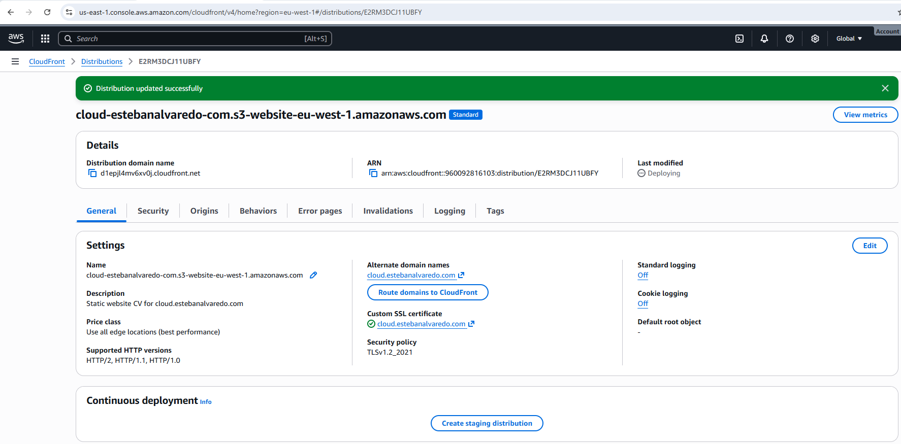

### CloudFront root domain routing settings  
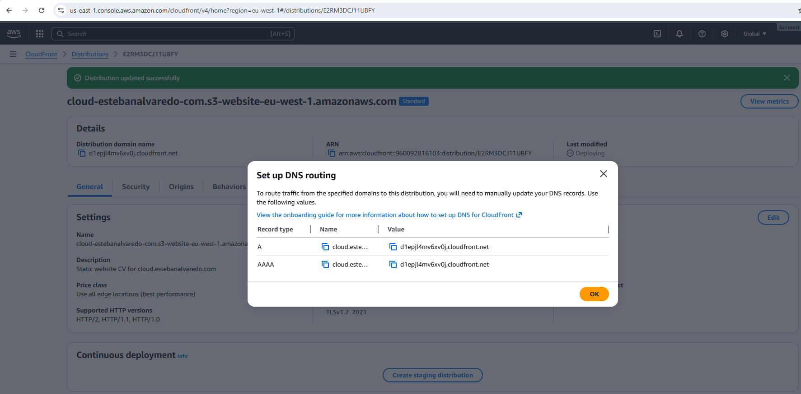

---

# 6. Custom Domain Configuration

### CNAME added at registrar  
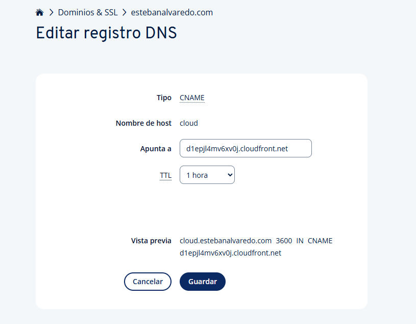

---

# 7. Final Result (HTTPS working)

### Website served over HTTPS through CloudFront  
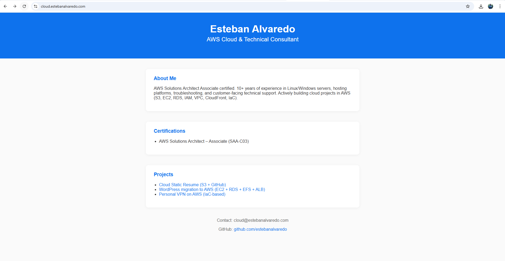

### Browser SSL certificate details  

---

# Project Completed

The static website is now:

- Hosted on Amazon S3
- Distributed via CloudFront
- Secured with ACM SSL
- Mapped to a custom domain
- Version-controlled via GitHub

This project establishes a clean, professional foundation for a Cloud Resume.
